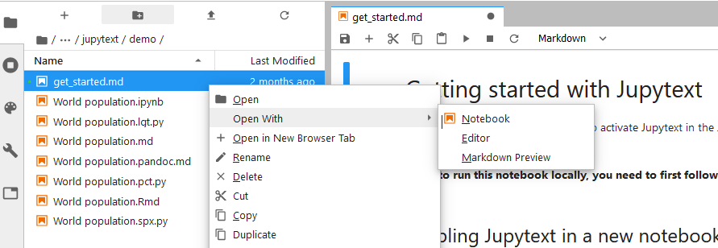

---
# Welcome to `codema-dev` projects!

Download, wrangle & explore all Irish energy datasets used by the `codema-dev` team

> ⚠️ Some projects use closed-access datasets for which you will need permission from the `codema-dev` team to use!  Email us at codema-dev@codema.ie


---

## Setup

Run the projects in your browser by clicking on the following buttons:


[](https://mybinder.org/v2/gh/codema-dev/projects-sandbox/main?urlpath=git-pull%3Frepo%3Dhttps%253A%252F%252Fgithub.com%252Fcodema-dev%252Fprojects%26urlpath%3Dlab%252Ftree%252Fprojects%252Fbinder.ipynb%26branch%3Dmain) ⬅️ click me to launch workspace

<details>
<summary>⬅️ click me</summary>
    
<br>

> `Binder` can take a few minutes to setup this workspace, click `Build logs > show` to see view the build progress.

- Double click on the project you want to open

- Right click on the `README.md` file, `Open With > Notebook` and run all cells



<br>
    
> ❓ `Binder` runs this code in the cloud for free with the help of `NumFocus`, if you find this useful consider donating to them [here](https://numfocus.org/)

> This link was generated using:
> - `Binder` on https://jupyterhub.github.io/nbgitpuller/link.html
> - environment repository = https://github.com/codema-dev/projects-sandbox 
> - content repository = https://github.com/codema-dev/projects-sandbox
    
</details>

---

[](https://gitpod.io/#https://github.com/codema-dev/projects) ⬅️ click me launch workspace

<details>
<summary>⬅️ click me</summary>

- Double click on the project you want to open

- Right click `README.md > Open Preview` to view the project guide
    
- Change your Terminal directory to a project folder by running:
    ```bash
    cd NAME-OF-PROJECT
    ```

⚠️ **Warning!** ⚠️
- If **`(/workspace/projects/venv)` disappears** from your prompt this means your Terminal no longer has access to all of the dependencies required to run projects so you need to reactivate it by running:
    ```bash
    conda activate /workspace/projects/venv
    ``` 
- If the **Terminal disappears** from the bottom of your screen click `≡ > Terminal > New`` Terminal` 
</details>

---

💻 Running locally

<details>
<summary>⬅️ click me</summary>

**Easy**:

- Install [Anaconda](https://www.anaconda.com/products/individual)
- [Import the `environment.yml`](https://docs.anaconda.com/anaconda/navigator/tutorials/manage-environments/#importing-an-environment) of a project via Anaconda Navigator
- Launch [VSCode from Anaconda Navigator](https://docs.anaconda.com/anaconda/user-guide/tasks/integration/vscode/)
- Install [Python for VSCode](https://marketplace.visualstudio.com/items?itemName=ms-python.python)
- Follow the GitPod instructions

**Lightweight**:

- Install: 
    - [VSCode](https://code.visualstudio.com/Download)
    - [mambaforge](https://github.com/conda-forge/miniforge)
    - [Python for VSCode](https://marketplace.visualstudio.com/items?itemName=ms-python.python)

- Install all project dependencies via each project's `environment.yml` in your Terminal:
    ```{code-cell} bash
    conda create env --file environment.yml && conda activate NAME-OF-ENVIRONMENT
    ```
    > Click the `environment.yml` to view the environment name

- Follow the GitPod instructions
</details>

---

## How-To Guides

⚠️ Accessing closed-access data

<details>
<summary>⬅️ click me</summary>

- Create a new file called `.env` in your project directory

- Add your s3 credentials to the `.env` file:

```
AWS_ACCESS_KEY_ID = "AKIA...."
AWS_SECRET_ACCESS_KEY = "KXY6..."
```
</details>

---

❓ FAQ

<details>
<summary>⬅️ click me</summary>

- If after running a project you see ...

    (1)
    ```python-traceback
    botocore.exceptions.NoCredentialsError: Unable to locate credentials
    ```
    ... follow the instructions at ⚠️ **Accessing closed-access data** 

    (2)
    ```python-traceback
    ModuleNotFoundError
    ```
    ... install the missing module with `conda install NAME` or `pip install NAME` and [raise an issue](https://github.com/codema-dev/projects/issues) on our Github

</details>

---

## Why?

In previous years all data wrangling was performed solely using `Microsoft Excel`.   Although this is useful for small datasets, it soon becomes a burden when working with multiple, large datasets.

For example, when generating the previous residential energy estimates it was necessary to create up to 16 separate workbooks for each local authority each containing as many as 15 sheets, as the datasets were too large to fit into a single workbook.  Although each workbook performed the same logic to clean and merge datasets, changing this logic meant changing all of the separate workbooks one at a time.

Moving to open-source scripting tools enabled using logic written down in scripts (or text files) to wrangle and merge data files, thus separating data from the logic operating on it.  This means that if any dataset is updated, re-generating outputs is as simple as running a few scripts.  Furthermore these scripts can be shared without sharing the underlying datasets.  

---

## Keeping the global `environment.yml` up to date

This `environment.yml` is built by merging the `environment.yml` from each project.  `Binder` & `GitPod` use it to create a sandbox environment in which all dependencies are installed.

To update this file run:

```bash
conda env create --file environment.meta.yml --name codema-dev-projects-meta
conda activate codema-dev-projects-meta
invoke merge-environment-ymls
```

> `conda env create` creates a virtual environment by reading `environment.meta.yml` in which `invoke` is defined as a dependency.  `invoke` then runs the function `merge_environment_ymls` from `tasks.py` which merges the `environment.yml` from each project and from `environment.meta.yml` together into a single `environment.yml` 

To speed up `Binder` builds, `Binder` reads the `codema-dev/projects` dependencies from a separate repository [codema-dev/projects-sandbox](https://github.com/codema-dev/projects-sandbox).  You must also update the `environment.yml` here with your newly generated `environment.yml` to keep `Binder` up to date!

> Every time any file is changed `Binder` rebuilds the entire repository and reinstalls the dependencies.  By keeping the environment and the content separate `Binder` only reinstalls dependencies when the dependencies change.  This means that it no longer has to download & resolve dependency conflicts which can take ~20 minutes. 
