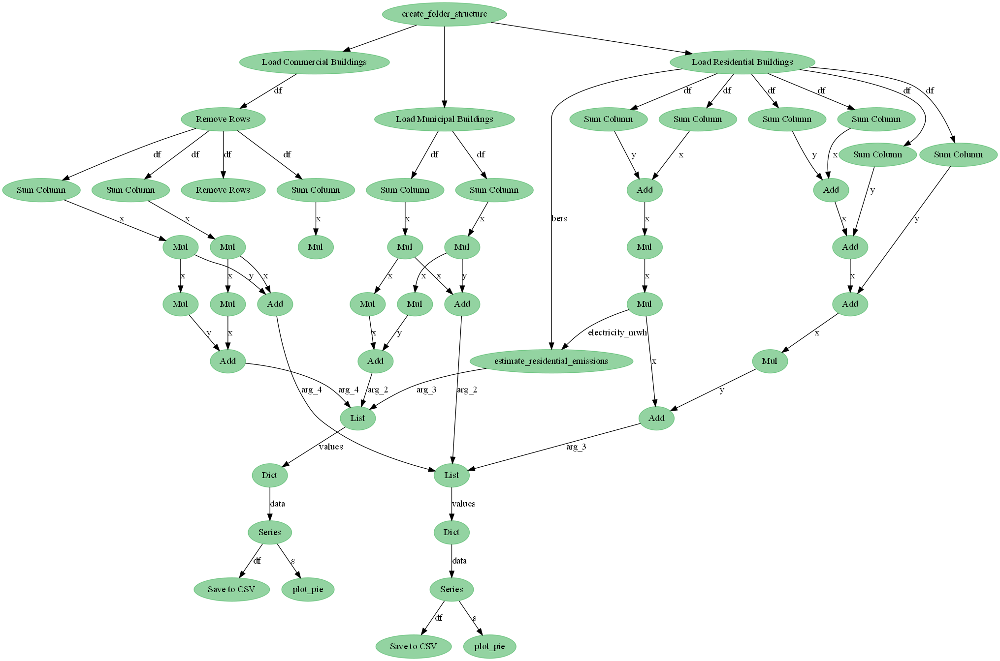
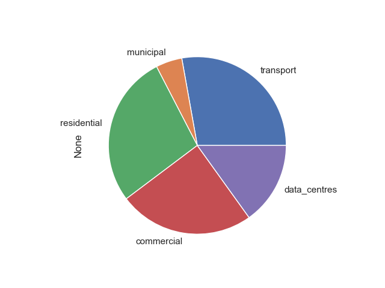
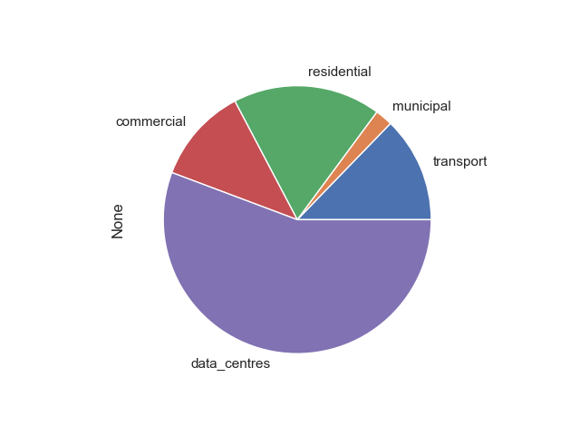

# Heat Demand Density

## What `pipeline.py` is doing:

- [x] Read Building Emissions - calculated by [`building-emissions`](../building-emissions)
- [x] Read Transport Emissions - calculated by the `National Transport Authority of Ireland` 
- [x] Amalgamate Emissions to All-of-Dublin level
- [x] Plot as a Pie chart 



## Outputs:

Carbon [tCO2/year]:


Energy [MWh/year]:


## Caveats

To fully reproduce the pipeline the user must:

- Have access to:
    - `National Transport Authority of Ireland` model outputs 

- Be comfortable enough with the command line to create a conda environment from an `environment.yml` and run the pipeline with `python pipeline.py`


## Setup

Via [conda](https://github.com/conda-forge/miniforge):

- Minimal
```bash
conda env create --file environment.yml --name stats
conda activate stats
```

Now run the pipeline:

```bash
python pipeline.py
```