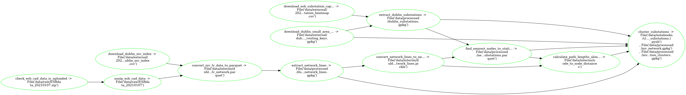

---
jupytext:
  cell_metadata_filter: -all
  text_representation:
    extension: .md
    format_name: myst
    format_version: 0.13
    jupytext_version: 1.12.0
kernelspec:
  display_name: Python 3 (ipykernel)
  language: python
  name: python3
---

# Cluster ESB Substations Along Network

<details>
<summary>⚠️ Before running the pipeline you must first fetch the ESB Networks CAD Network files</summary>

- Create a new folder called `data` and drag & drop `ESBdata_20210107.zip` to a new folder within it called `raw`
</details>

+++

## What `pipeline.yaml` is doing:



+++

## Run pipeline

On Binder:
```{code-cell} bash
!ploomber build
```

OR on your Terminal:
```{code-cell} bash
ploomber build
```