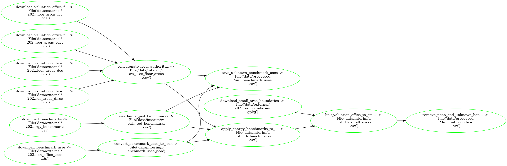

---
jupytext:
  cell_metadata_filter: -all
  text_representation:
    extension: .md
    format_name: myst
    format_version: 0.13
    jupytext_version: 1.12.0
kernelspec:
  display_name: Python 3 (ipykernel)
  language: python
  name: python3
---

# Estimate Commercial Energy via Valuation Office Floor Areas

> ⚠️ Requires access to the closed-access Valuation Office Floor Area files!

## What `pipeline.py` is doing:



## Run pipeline

On Binder:

```{code-cell} ipython3
%%writefile .env
AWS_ACCESS_KEY_ID="AKIA..."
AWS_SECRET_ACCESS_KEY="KXY6w..."
```

```{code-cell} ipython3
!ploomber build
```

OR on your Terminal:

```{code-cell} ipython3
ploomber build
```
