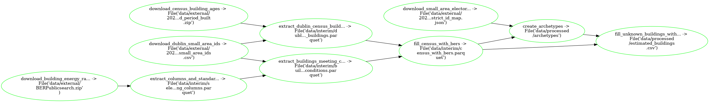

---
jupytext:
  cell_metadata_filter: -all
  text_representation:
    extension: .md
    format_name: myst
    format_version: 0.13
    jupytext_version: 1.12.0
kernelspec:
  display_name: Python 3 (ipykernel)
  language: python
  name: python3
---

# Estimate Residential Building Characteristics (i.e. area, boiler, demand)

## What `pipeline.yaml` is doing:



## Run pipeline

On Binder:

```{code-cell} ipython3
!ploomber build
```

OR on your Terminal:

```{code-cell} ipython3
ploomber build
```

## Now, explore the Ireland BERs with Dask

```{code-cell} ipython3
from helper import read_bers

bers = read_bers("data/BERPublicsearch.zip", how="dask")
len(bers)
```

# ... for more information on using `dask` to explore the bers see https://tutorial.dask.org/