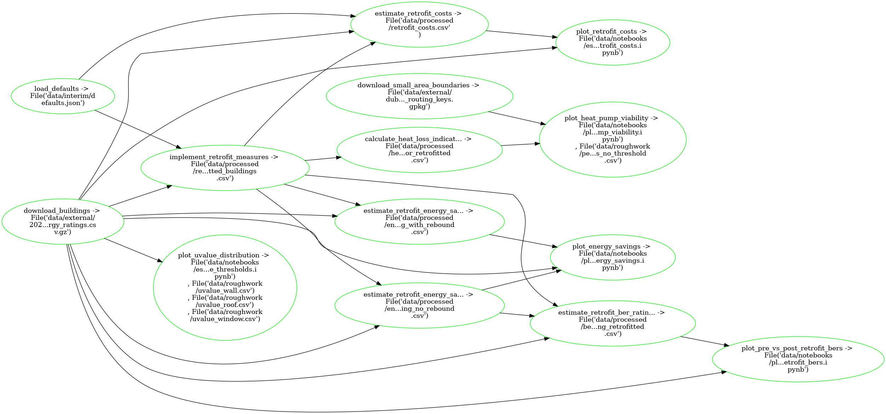

---
jupytext:
  cell_metadata_filter: -all
  text_representation:
    extension: .md
    format_name: myst
    format_version: 0.13
    jupytext_version: 1.12.0
kernelspec:
  display_name: Python 3 (ipykernel)
  language: python
  name: python3
---


# Estimate Retrofit Impact on Residential Heat Pump Viability

This project uses [codema-dev/rc-building-model](https://github.com/codema-dev/rc-building-model) to apply the [DEAP](https://www.seai.ie/home-energy/building-energy-rating-ber/) model at scale to a few hundred thousand builings to find the impact of retrofitting on:

- Energy savings
- BER rating
- Heat Loss Indicator (HLI) or heat pump viability 

## What `pipeline.yaml` is doing:



## ❓ Assumptions 
In order to estimate retrofit impact it was necessary for this project to make some assumptions:

| Component | Threshold U-Value [W/m²K] | Target U-Value [W/m²K] | Cost Lower [€/m²] | Cost Upper [€/m²]
| --- | --- | --- | --- | --- |
| Wall | 1 | 0.35 | 50 | 300 |
| Roof | 1 | 0.25 | 5 | 30 |
| Window | 2 | 1.4 | 30 | 150 |

- **Threshold U-Value** - the U-Value below which no dwelling is likely to retrofit that fabric component
- **Target U-Value** - the U-Value all viable dwellings will obtain upon retrofitting their dwelling
- **Cost Lower** & **Cost Upper** - cheap and expensive scenarios 

🔨 All of these assumptions can be replaced by editing the `pipeline.yaml` and rerunning the pipeline!

## Editing the retrofit measures


## Run pipeline

On Binder:

```{code-cell} ipython3
!ploomber build
```

OR on your Terminal:

```{code-cell} ipython3
ploomber build
```
