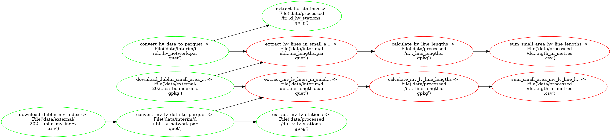

# Extract Dublin Electricity Lines & Substations

| :exclamation:  Requires ESB Networks CAD Network files |
|--------------------------------------------------------|
    
## What `pipeline.py` is doing:



## Install

| :exclamation:  Skip unless running this locally |
|-------------------------------------------------|

Via [conda](https://github.com/conda-forge/miniforge):

- Minimal
```bash
conda env create --file environment.yml --name extract-dublin-electricity-infrastructure
conda activate extract-dublin-electricity-infrastructure
```

## Run

Now run the pipeline:

```bash
ploomber build
```