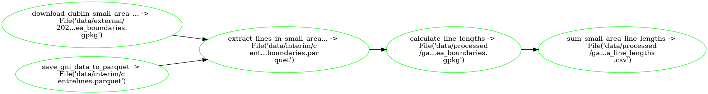

# Extract Dublin Gas Lines

| :exclamation:  Requires GNI Network files |
|-------------------------------------------|

## What `pipeline.py` is doing:



## Setup

| :exclamation:  Skip unless running this locally |
|-------------------------------------------------|

Via [conda](https://github.com/conda-forge/miniforge):

```bash
conda env create --file environment.yml --name extract-dublin-gas-lines-from-network
conda activate extract-dublin-gas-lines-from-network
```

## Run 

Now run the pipeline:

```bash
ploomber build
```