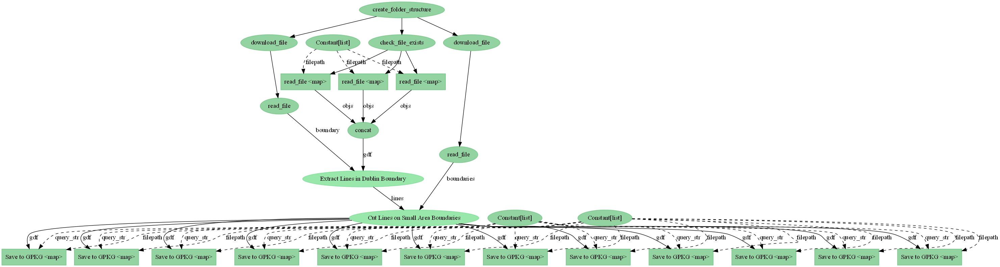

# Heat Demand Density

## What `pipeline.py` is doing:



## Caveats

To fully reproduce the pipeline the user must:
- Have access to `ESB Networks` electricity grid infrastructure files
- Be comfortable enough with the command line to create a conda environment from an `environment.yml` and run the pipeline with `python pipeline.py`

## Setup

Via [conda](https://github.com/conda-forge/miniforge):

- Minimal
```bash
conda env create --file environment.yml
conda activate hdd
```

Now run the pipeline:

```bash
python pipeline.py
```