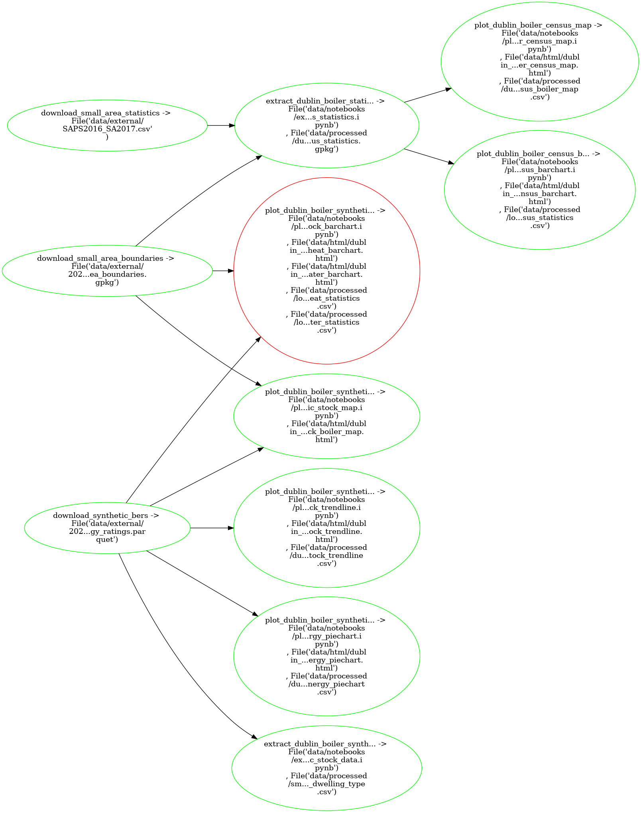

---
jupytext:
  cell_metadata_filter: -all
  text_representation:
    extension: .md
    format_name: myst
    format_version: 0.13
    jupytext_version: 1.12.0
kernelspec:
  display_name: Python 3 (ipykernel)
  language: python
  name: python3
---


# Plot Residential Boiler Stats

## What `pipeline.yaml` is doing:



## Setup

| ❗  Skip if running on Binder  |
|-------------------------------|

Via [conda](https://github.com/conda-forge/miniforge):

```{code-cell}
conda env create --file environment.yml --name plot-residential-boiler-stats
conda activate plot-residential-boiler-stats
```

## Run 

```{code-cell}
!ploomber build
```
