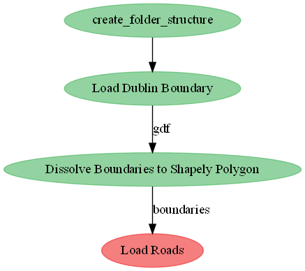

# Road Line Lengths

## What `pipeline.py` is doing:



## Setup

Via [conda](https://github.com/conda-forge/miniforge):

- Minimal
```bash
conda env create --file environment.yml --name line-lengths
conda activate line-lengths
```

Now run the pipeline:

```bash
python pipeline.py
```